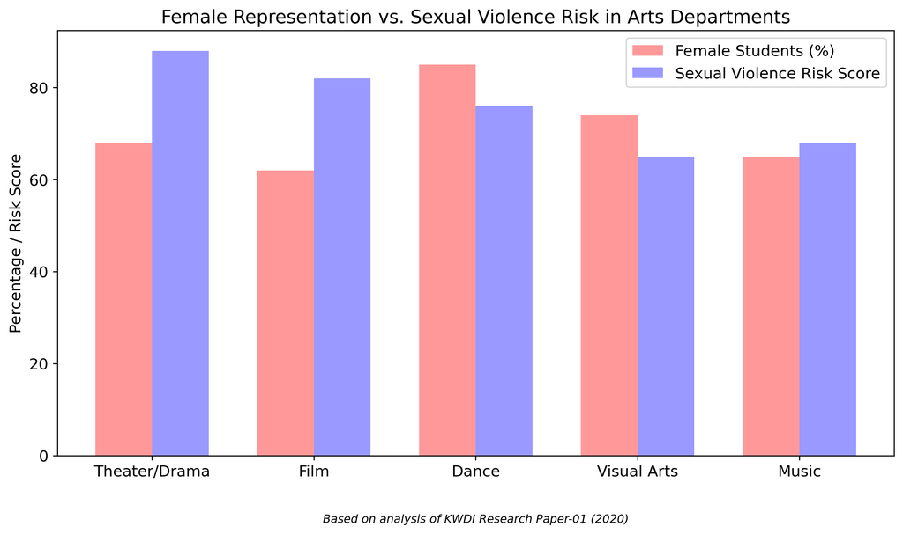
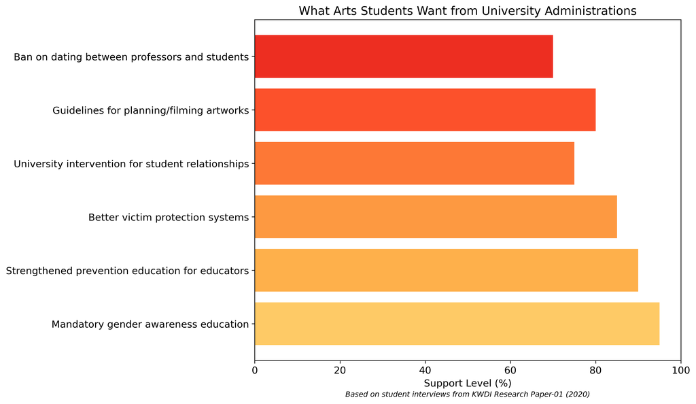

# Dongguk Exposed: Sexual Violence & Institutional Negligence

  

## License

This project is released under the [CC0 1.0 Universal (CC0 1.0) Public Domain Dedication](https://creativecommons.org/publicdomain/zero/1.0/). This means:

- You are free to use, share, modify and distribute this work for any purpose, including commercial use
- No attribution is required
- All content, code, and materials in this repository may be used without restrictions

We believe these important issues should be freely accessible and shareable without limitation.

## How to Access This Repository

### Option 1: View Online (Easiest Method)
Visit the [Gender Watchdog Timeline Website](https://genderwatchdog.org) to view all materials online.

### Option 2: Download as ZIP File
1. Visit the [repository website](https://github.com/genderwatchdog1/timeline-website)
2. Click the green "Code" button near the top of the page
3. Select "Download ZIP" from the dropdown menu
4. Once downloaded, extract the ZIP file to a folder on your computer
5. Open the folder and double-click on "index.html" to view the content in your web browser

### Option 3: Clone with Git
If you're familiar with Git:
1. Open your terminal or command prompt
2. Navigate to the directory where you want to clone the repository
3. Run: `git clone https://github.com/genderwatchdog1/timeline-website.git`
4. Navigate into the cloned directory: `cd timeline-website`
5. Open "index.html" in your web browser to view the content

## Repository Contents

This repository documents research on sexual violence in arts education with a focus on Dongguk University's institutional failures to address harassment issues.

---

# Title IX Risk Advisory: Dongguk University Sexual Harassment Exposure

Institutional Risk Factors at Dongguk University:

  * No visible, independent reporting system for sexual violence and sexual assault
  * Zero full-time female faculty in the graduate film program
  * Abolition of the Women's Student Council during the height of Korea's MeToo movement (2018)
  * Shared campus space with commercial film entities (e.g., Sidus FNH), blurring lines between academic authority and industry power dynamics, creating additional sexual violence risks
  * Documented pattern of institutional negligence in responding to sexual assault cases:
    * Took no action for 6 months after being notified in February 2016 about a professor's sexual assault of a student
    * Only implemented a token "professor replacement policy" in August 2016, 9 months after the assault occurred in November 2015.
    * Failed to take disciplinary action against the professor until formal prosecution occurred in September 2016
  * History of prioritizing institutional reputation over student safety through delayed responses and minimal interventions
  * Fundamentally flawed reporting mechanisms:
    * In the 2015 sexual assault case, the victim reported to police rather than university channels, revealing a profound lack of trust in institutional protections
    * The three-month gap between the November 2015 assault and February 2016 university notification demonstrates how institutional barriers prevent timely reporting and intervention
    * Korea's strict hierarchical academic culture creates overwhelming pressure for students to remain silent about faculty misconduct

These structural barriers to reporting mirror findings from the KWDI's research, which identifies how Korea's Confucian academic tradition creates multiple layers of silencing:
1. Power asymmetry between professors and students is extreme, with professors controlling not only academic outcomes but future career prospects
2. Cultural emphasis on "saving face" prioritizes institutional reputation over victim protection
3. Victims face severe social stigmatization and potential academic retaliation if they report through internal channels
4. The absence of female faculty or student advocacy groups removes crucial support systems that might otherwise facilitate safe reporting

These factors combine to create a statistically high-risk environment for sexual violence, particularly in a country where — according to a 2021 study by the Korean Women's Development Institute (KWDI) — arts graduate programs are among the highest-risk environments for sexual violence and sexual abuse by faculty.

## Confirmed Cases of Institutional Misrepresentation

Despite these red flags, Dongguk continues to publicly list a wide range of U.S., Canadian, and European universities as partners on its official website: [Dongguk International Partners](https://www.dongguk.edu/eng/page/554)

Archived on April 8, 2025: [Dongguk International Partners](https://web.archive.org/web/20250408154026/https://www.dongguk.edu/eng/page/554)

Two examples of misrepresentation from contacted institutions:

**Canada:** "We do not have a student exchange agreement with Dongguk University."

**United States:** "We are undergoing a review of all of our exchange partners and will take this into consideration and will reach out to our partners at Dongguk accordingly."

**Global University Rankings Organization** "Hello, Thank you for bringing this to our attention. We've forwarded this to our management for their attention. Kind regards,"

These responses confirm that some schools currently listed by Dongguk have no active relationship with the university, suggesting possible false advertising of partnerships.

## Timeline of Events

- **2008:** Shingate Scandal - Major scandal involving institutional misrepresentation
- **November 2015:** Media Communication Professor at Dongguk University sexually assaults student
- **February 2016:** Media Communication Professor sexual assault case reported to the university
- **August 2016:** Professor Replacement Policy introduced, allowing students to switch professors in abuse cases
- **2018:** Female Student Council Abolished during the height of the MeToo movement
- **2020:** KWDI Report published on sexual violence in arts education after MeToo
- **March 8-9, 2025:** Initial email outreach to Dongguk University, no response
- **March 14-15, 2025:** All faculty members contacted, no responses
- **April 5, 2025:** Main Blog Published - "Dongguk Exposed: A Decade of Sexual Harassment Negligence"
- **April 5-6, 2025:** Title IX Risk Escalation - Dongguk's dismissive response: "For what purpose did you send the e-mail?"
- **Since April 6, 2025:** University Silence - Institution refuses further engagement

---

# Sexual Violence in Arts Education After Me Too: Current Status and Policy Issues

## Introduction

The 2018 Me Too movement in South Korea revealed alarming levels of sexual violence in arts education. This comprehensive study by the Korean Women's Development Institute examines the unique characteristics of sexual harassment in conservatories and art schools, revealing how the apprenticeship model and hierarchical structures create environments where abuse thrives.

## Key Findings

### Prevalence and Characteristics

The research uncovered that arts and sports departments had significantly higher rates of sexual harassment and violence compared to other university departments. In the culture and arts sectors, power dynamics create particularly vulnerable situations:

- Male professors hold disproportionate power despite female students being the majority in most arts departments
- The "artist-mentor" relationship extends beyond normal teaching boundaries
- Professors serve as crucial industry gatekeepers for students' future careers
- "Artistic expression" is often used to justify inappropriate sexual behavior

### High-Risk Environments

Sexual harassment occurs in multiple settings within arts education:

- Classrooms (through inappropriate examples or demonstrations)
- Research and practice rooms
- Mandatory social gatherings and drinking events
- Private meetings with professors or visiting artists

Physical contact during practice sessions creates particularly ambiguous situations without clear boundaries or consent guidelines.

### Structural Factors

The study identified several institutional failures that allow abuse to continue:

- Universities lack adequate support systems for victims
- Grievance counseling bodies have low organizational status and insufficient resources
- Prevention education is inconsistent and often ineffective
- Disciplinary actions against perpetrators are frequently lenient or poorly enforced
- Victims face secondary trauma during investigation processes

## Student Responses and Activism

The Me Too movement empowered students to speak out through various channels:

- Social media disclosures and anonymous online communities
- Hand-written posters in university spaces
- Student government emergency committees
- Demands for institutional accountability

Students organized to collect incident reports, demand university action, represent victims in disciplinary processes, and provide support resources. However, they frequently encountered resistance from institutions and faculty.

## Recommendations for Change

The research proposes comprehensive policy improvements:

1. **Ministerial Responsibility**: The Ministry of Education must strengthen oversight, modify relevant laws, and incorporate sexual harassment prevention into university evaluations

2. **Grievance Handling**: Establish stronger legal foundations for grievance bodies, ensure adequate staffing with trained personnel, and improve confidentiality protections

3. **Conservatory-Specific Policies**: Increase inter-ministerial cooperation, share perpetrator information between agencies, and expand gender awareness curriculum

4. **Regulatory Improvements**: Restrict perpetrators from resigning to avoid consequences, improve victim notification procedures, and enhance prevention education effectiveness

## Conclusion

Creating safe educational environments in arts fields requires addressing the unique power dynamics and cultural factors that enable abuse. This research reveals both the scale of the problem and provides a roadmap for institutional and policy change.

---

## Contact and Additional Resources

- Email: [genderwatchdog@proton.me](mailto:genderwatchdog@proton.me)
- Website: [Gender Watchdog Blog](https://blog.genderwatchdog.org/)

**Sources:**
- [Download charts (.png)](https://drive.proton.me/urls/JQ0FXSJJPC#JMkuipzUtH3B)
- [Download full report (PDF)](https://drive.proton.me/urls/BAPF2DA400#4RGLR08iLFAJ)
- [Archived Faculty Directory - Dongguk University](https://web.archive.org/web/20250413005624/https://www.dongguk.edu/eng/dandae/122#)
- [Gender Watchdog - Structural Risk Report](https://blog.genderwatchdog.org/between-ethics-and-exploitation-gender-risk-in-koreas-buddhist-affiliated-film-program/)
- [Fictional Partnerships with North American Universities](https://blog.genderwatchdog.org/title-ix-and-fake-partnerships-dongguk-university-under-global-review/)
- [Screenshots of Responses](https://drive.proton.me/urls/95J0T3K37R#RBCO657BAC6a)
- Original research: "Current Status of Sexual Violence Against University Students in the Culture and Arts after the Me Too Movement and Policy Issues" (2020) by Mijeong Lee, Deuk-kyoung Yoon, Heasang Jeon, Sooyeon Jung, Sung-Mi Lee, Korean Women's Development Institute

## Repository Images

### Arts Education Charts
The `imgs` folder contains visual data from the 2020 KWDI report on sexual violence in arts education, organized in multiple language subfolders:

- `arts_education_charts_en`: English versions of the charts
- `arts_education_charts_ja`: Japanese versions
- `arts_education_charts_ko`: Korean versions
- `arts_education_charts_zh-CN`: Simplified Chinese versions
- `arts_education_charts_zh-TW`: Traditional Chinese versions

Each subfolder contains the following charts:
- `female_vulnerability.png`: Factors contributing to female students' vulnerability
- `harassment_by_gender.png`: Sexual harassment experiences by gender
- `harassment_locations.png`: Common locations where sexual harassment occurs
- `structural_factors.png`: Structural factors enabling abuse in arts education
- `student_demands.png`: Student demands for institutional change

These images are used in the timeline to highlight key events, including the February 2016 and August 2016 incidents at Dongguk University.

### QR Codes
The `qr-codes` folder contains shareable QR codes that connect to:
- The Gender Watchdog YouTube channel
- The timeline website deployed on GitHub Pages (this repository)

These QR codes can be printed or shared digitally to increase accessibility and awareness of these resources.
